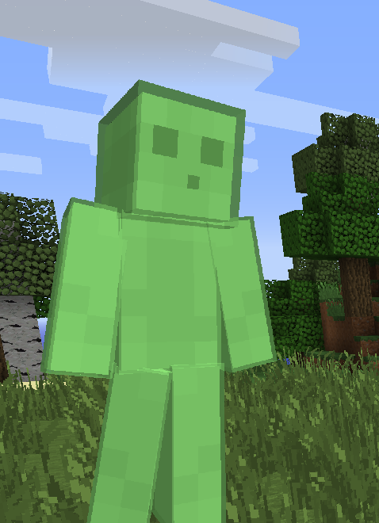

# StarlightSkinRenderer

[](https://opensource.org/licenses/MIT)
[](https://www.oracle.com/java/technologies/javase-downloads.html)
[](https://minecraft.net)
[](https://starlightskins.lunareclipse.studio)

<p align="center">
  
</p>

---

**StarlightSkinRenderer** is a lightweight skin renderer for Minecraft 1.7/1.8 (MCP/Forge), using the [Starlight Skins API](https://starlightskins.lunareclipse.studio).  
It dynamically fetches and renders player skins in various 3D poses by querying the API, supporting both Mojang premium skins and custom skin servers.

---

## ✨ Features

- ✅ 24 different 3D render types (from the Starlight Skins API)
- ✅ Crop modes: `FULL`, `BUST`, `FACE`
- ✅ Works with Mojang premium skins or custom skin servers (via dynamic URL)
- ✅ Automatic scaling, centering, and validation
- ✅ Fully asynchronous image downloads (non-blocking)
- ✅ Advanced caching with expiration and memory management
- ✅ Detailed logs for debugging and error tracking
- ✅ Fluent Java builder API
- ✅ Compatible with Minecraft 1.7/1.8 (MCP or Forge)
- ✅ Standalone, single-class implementation (drop it in and use!)

---

## 🖼 Preview

<p align="center">
  
</p>

---

## 🚀 Quick Example

```java
StarlightSkinRenderer.builder()
    .username("CipheR_") // Minecraft username or custom API name
    .renderType(StarlightSkinRenderer.RenderType.MARCHING)
    .cropType(StarlightSkinRenderer.CropType.FULL)
    .customSkinUrl("https://yourwebsite.com/skins/{{username}}") // Optional for custom skin APIs
    .position(100f, 200f)
    .scale(150f)
    .centered(true)
    .render();
```

✅ If using `customSkinUrl`, replace it with your own skin API.  
Use `{{username}}` as a placeholder for the player's name.

---

## 🧱 How It Works

1. **Fetches Skins Dynamically**:  
   The class queries the [Starlight Skins API](https://starlightskins.lunareclipse.studio) to fetch a generated image of the player's skin in the specified pose and crop. You can use Mojang's premium skin system or your own custom API for skins.

2. **Supports 3D Poses and Crops**:  
   Choose from 24 3D poses and 3 crop modes (`FULL`, `BUST`, or `FACE`) to render your skin.

3. **Asynchronous and Cached**:  
   Skins are downloaded asynchronously to avoid blocking the game and cached in memory for faster subsequent loads.

---

## 🧱 Supported Render Types

```text
CLOWN, HIGH_GROUND, READING, MOJAVATAR, KICKING, ARCHER, DEAD, SLEEPING,
FACEPALM, DUNGEONS, LUNGING, POINTING, COWERING, TRUDGING, RELAXING,
CHEERING, HEAD, ISOMETRIC, ULTIMATE, CRISS_CROSS, WALKING, MARCHING, DEFAULT
```

> ⚠ Some types support only specific crop modes:  
> - `HEAD` → `FULL` only  
> - `SLEEPING`, `MOJAVATAR` → `FULL`, `BUST` only

---

### 🧠 Advanced Caching

- **How it works**: Skins are downloaded once and cached in memory, with automatic expiration after 10 minutes.
- **Memory efficiency**: Expired skins are automatically removed from the cache.

---

## 📦 Installation

This is a standalone Java class that can be dropped directly into an MCP or Forge project.  
Tested with Minecraft **1.7.10**, and compatible with 1.8 and 1.9+ with small adjustments.

---

## 🧑‍💻 License

Released under the **MIT License**.  
Free to use in mods, GUIs, launchers, or any other project.

---

## 🙏 Credits

- Powered by the [Starlight Skins API](https://starlightskins.lunareclipse.studio)
- Inspired by modern 3D skin previews like Lunar Client and SkinsRestorer
